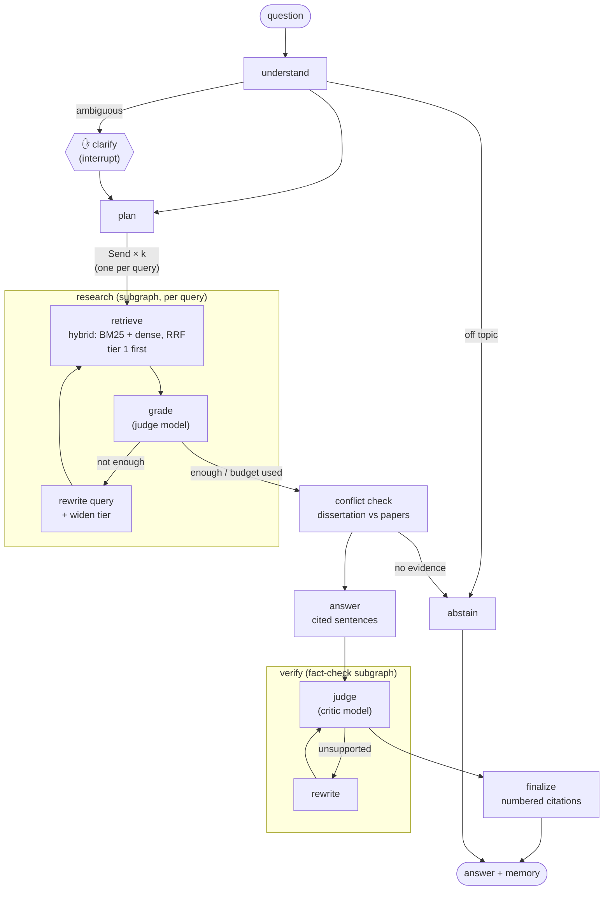

# labmate

> Local research tools on Ollama: paper overviews, LinkedIn posts, and cited answers about a paper library.

labmate is a set of features on one shared core: local models via Ollama, every model
call recorded and replayable, traced, and evaluated.

| Feature | What it does | How it is built |
|---|---|---|
| **paper2flow** | A research paper in, `overview.pdf` out: a cover, four fact-checked cards and data-flow diagrams | A **LangChain chain** (LCEL): the path is known, so the steps are fixed |
| **paper2post** | A research paper in, `post.pdf` out: a fact-checked LinkedIn post with icons, links and the pipeline image | A **LangChain chain** that extends paper2flow's analysis |
| **ask** | Questions about my research, answered from my PhD dissertation and papers, with page citations | A **LangGraph agent**: agentic RAG with routing, loops, interrupts and memory |

Chains where the path is known, a graph where it depends on the input.

## Shared core (`labmate.core`)

- **Local and free:** a Mac mini M4 (32 GB) with Ollama. No paid APIs.
- **Reproducible:** every model call and every download is recorded to a cassette;
  `--mode replay` reruns a paper without a model or the network.
- **Grounded:** claim cards carry verbatim quotes checked against the source; a
  fact-check loop (evaluator–optimizer) rewrites or drops unsupported statements.
- **Observable:** one LangChain callback handler traces every chain step, graph node and
  model call to `trace.jsonl` (with an HTML viewer). LangSmith, when switched on, listens
  to the same events.
- **LangChain on a recorded backend:** `RecordedChatModel` is a LangChain chat model whose
  calls go through the cassettes; `structured` validates replies against a Pydantic
  schema and retries with the error fed back (the MLX model builds ignore Ollama's
  `format=`, so the schema also goes into the prompt).

## paper2flow

```
analyze    = ingest | publication | route | extract | outline | write | factcheck | flows
paper2flow = analyze | render                                          -> overview.pdf
```

`overview.pdf` (A4 portrait):

1. the **cover**: title, authors, venue and publication date, and the paper's main figure;
2. the **four cards** of a project page: **Task**, **Challenges**, **Proposed method**,
   **Main results**;
3. the **end-to-end data flow**, top to bottom, from the raw data to the target output;
4. one page per **detail flow** that breaks a step of the overview down ("detail A", …).

Every step is a named Runnable that fills in one field of the chain's state and saves it
as a JSON artifact in `runs/<paper id>/`. The agentic patterns live inside the steps:

| Step | Pattern | What it does |
|---|---|---|
| ingest | plain code | arXiv id or URL, PDF URL or PDF path → sections via the PDF outline, figures cropped, arXiv metadata |
| publication | structured output + check | venue and publication date read off the first page; accepted only if copied verbatim from it |
| route | routing | title + abstract → method / benchmark / survey / position |
| extract | parallelisation | per section (`.batch`): claim cards with verbatim quotes; quotes not in the paper, or with other numbers, are dropped in code |
| outline | orchestrator | assigns claim cards to the four cards; rules checked in code and fed back on violation |
| write | prompt chaining | one call per card, in parallel; every bullet cites the claim ids it uses |
| factcheck | evaluator–optimizer | numbers and names must be in the cited quotes; a different model judges each bullet; failures are rewritten (≤ 2 rounds), then dropped |
| flows | orchestrator–workers | the planner draws the end-to-end flow and picks 1–3 steps; one worker per step draws its detail. Checked in code: starts at inputs, ends at outputs, grounded labels, no invented numbers |
| render | plain code | typed graphs → Mermaid (house style) → PNG with mermaid-cli; Typst lays out the PDF, no creation date, so the same run renders the same bytes |

The model only ever proposes *data* (typed boxes and arrows); code validates it and
writes the Mermaid, so no model output reaches a diagram or a page unchecked.

## paper2post

```
paper2post = analyze | post | icons | render                          -> post.pdf
```

`post.pdf` (4:5 pages): page 1 is the post text, ready to copy (hook, 3–5 sentences
telling the paper's story, a question), one icon per sentence (a bundled set of Tabler
Icons, so the model can only pick valid ones) and the links: the paper, its code if it
names a repository, and your own links from `config.toml` `[post.links]`. Page 2 is the
end-to-end pipeline diagram, to attach as the post's image. Every sentence passes the
same fact-check as the overview. Running both chains on a paper costs only the post's
own model calls: the analysis replays from cassettes.

## Evaluation

```bash
make eval    # metrics of every finished run -> evals/results.md, results.json
```

- **Run metrics** come from the run artifacts and the trace, no model needed: verified vs
  rejected claims, the share of first-draft bullets that failed the fact-check, bullets
  dropped after the loop, *card fit* (the share of bullets citing a claim of their card's
  kind, e.g. a result under Main results), the size of the flow diagrams, model calls,
  tokens, model swaps and compute time.

## ask

Questions about my research, answered with citations such as "[Dissertation §4.2, p. 57]".
The PhD dissertation is the source of truth; my papers add detail; outside papers (such as the
ones run through paper2flow) are context only.



### Why it is an agent (and a graph)

The path depends on the question, so it is decided at run time:

- **Routing:** off-topic questions are declined without searching; an ambiguous one
  pauses the graph and asks which reading is meant (`interrupt`, resumed with `Command`).
- **Parallel research:** the planner splits a question into 1–4 queries and each runs
  as its own branch (`Send`), a **subgraph** that retrieves, grades the evidence with the
  judge model, and rewrites the query and widens the search (dissertation → papers)
  until the evidence is enough or the loop budget is used.
- **Conflict check:** numbers that differ between the dissertation and a paper are
  reported, and the dissertation wins. Each reported value must be written in its chunk.
- **Self-verification:** the same fact-check subgraph as paper2flow judges every
  sentence against the chunks it cites; sentences that stay unsupported are dropped.
- **Memory:** a SQLite checkpointer keeps the conversation per thread, so follow-ups
  ("and how long does training take?") are rewritten into standalone questions.

The baseline is LangChain's prebuilt tool-calling agent (`create_agent`) with three
tools (`search_library`, `read_context`, `list_sources`). Both run on the same recorded
models, the same index and the same judge, so `make eval-answers` compares them fairly.
LangChain is used for its interfaces only: a chat model, embeddings and a retriever
over the recorded backend.

### Retrieval

- **Library:** `library/library.toml` lists the PDFs with a tier (1 dissertation,
  2 own papers, 3 outside) and the thesis points each paper backs.
- **Chunks:** sections from the PDF outline (chapter › section › subsection),
  sentence-packed chunks of ~180 words, figure captions, one chunk per thesis point, and
  chapter summaries; the answer model sees each hit with its neighbours (small-to-big).
- **Search:** BM25 (SQLite FTS5) and exact dense search (`embeddinggemma`), fused with
  reciprocal rank fusion; everything lives in one SQLite file.
- **Evaluation without hand labels:** questions are generated from verified claim cards,
  so the chunk holding the quote is the gold answer; `make eval-rag` reports recall@k and
  MRR for BM25, dense, hybrid and hybrid + query rewriting.

### Try it

```bash
make index                                      # library/*.pdf -> library/index.sqlite
make ask Q="Which datasets were used to evaluate BlinkLinMulT?"
make ask Q="and how robust is it to head pose?" THREAD=demo   # follow-up in the same thread
make ask Q="…" AGENT=prebuilt                   # the tool-calling baseline
make eval-rag                                   # evals/ask/retrieval.md
make eval-answers                               # evals/ask/answers.md (library/golden.yaml)
make dashboard                                  # live UI at http://localhost:8080
make demo                                       # the UI replaying recorded sessions, no Ollama
make graphs                                     # docs/graphs.md, drawn from the compiled graphs
make studio                                     # LangGraph Studio (langgraph.json)
```

The dashboard shows the diagram above lighting up node by node as the graph streams,
which model is loaded and what it has cost (calls, tokens, seconds, cache hits), the
agent's trail, the retrieved chunks with their BM25 and dense ranks, and the answer with
expandable citations. It can switch between the graph and the prebuilt agent.

## Models

| Role | Model |
|---|---|
| Writer / planner | `qwen3.6:35b-mlx` |
| Fact-checker (judge) | `gemma4:26b-mlx` |

Only one large model fits in memory at a time, so the pipeline runs in phases and unloads
the previous model when it switches.

**Probe findings** (`make probe`, Ollama 0.24, Mac mini M4): the MLX builds ignore Ollama's
`format=` JSON constraint (0/10 valid) but follow a schema given in the system prompt (10/10),
so the pipeline always sends both and validates with a retry loop.

## Quickstart

```bash
make install     # uv sync + pre-commit hooks + mermaid-cli (needs Node.js)
make check       # lint + type-check + tests + docs (no Ollama needed)

# with Ollama running:
make lock        # pin installed model digests into models.lock
make probe       # verify structured output, tool calling and determinism
make flow PAPER=1706.03762                 # runs/1706.03762/overview.pdf
make post PAPER=1706.03762                 # runs/1706.03762/post.pdf
make flow PAPER=1706.03762 MODE=replay     # the same run from cassettes, no model or network
make flow PAPER=https://adamfodor.com/pdf/2023_Fodor_Adam_MDPI_BlinkLinMulT.pdf
make trace PAPER=1706.03762                # runs/1706.03762/trace.html
```

## Replay modes

Set `[replay].mode` in `config.toml`:

| Mode | Behaviour |
|---|---|
| `live` | always call Ollama, store nothing |
| `record` | always call Ollama, (over)write cassettes |
| `auto` | cassette if present, otherwise call and record (dev default) |
| `replay` | cassettes only; a miss is an error (no model or network needed) |

## License

[AGPL-3.0-or-later](LICENSE). PyMuPDF, used for PDF parsing, is AGPL-licensed.
