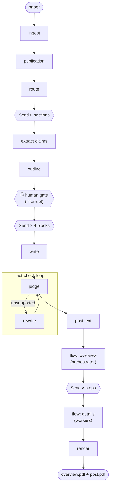

# labmate

> A local research assistant built from agentic patterns. Fully local, fully reproducible.

labmate is a collection of features, each chosen to show a different way of building
with LLMs, all on one shared core: local models via Ollama, every model call recorded and
replayable, traced, and evaluated.

| Feature | What it does | How it is built | Status |
|---|---|---|---|
| **paper2flow** | A research paper in, a fact-checked overview with data-flow diagrams and a LinkedIn post out | A **workflow**: fixed steps (routing, parallel extraction, an orchestrator, a human gate, chaining, a fact-check loop, orchestrator–workers), in plain Python and, as a second engine, in LangGraph | done |
| **ask** | Questions about my research, answered from my PhD dissertation and papers, with page citations | An **agent**: agentic RAG in LangGraph (tiered hybrid retrieval, grading and query rewriting loops, conflict checks, self-verification, multi-turn memory), compared against a prebuilt tool-calling agent | planned |

Workflows where the path is known, an agent where it isn't.

## Shared core (`labmate.core`)

- **Local and free:** a Mac mini M4 (32 GB) with Ollama. No paid APIs.
- **Reproducible:** every model call is recorded to a cassette; `replay` mode reruns a
  run byte-for-byte without any model installed, and CI does exactly that.
- **Grounded:** claim cards carry verbatim quotes checked against the source; a
  fact-check loop (evaluator–optimizer) rewrites or drops unsupported statements.
- **Observable:** every step and model call is traced (`trace.jsonl`, HTML viewer).

## paper2flow

**Status: pre-alpha, feature-complete for v0.1.** Routing, parallel claim extraction with
a quote-verification guard, an orchestrated four-block outline, a human approval gate,
grounded writing, a fact-check loop, and flow diagrams planned by an orchestrator and
drawn by workers, every label checked against the paper. All traced and replayable, with
an evaluation suite (run metrics and judge agreement against human labels), an HTML trace
viewer, a static gallery that anyone can replay from cassettes, and two interchangeable
orchestration engines (plain Python and LangGraph).

### What it does

```
paper (arXiv id, PDF or URL) ─▶ ingest ─▶ venue & date ─▶ route ─▶ extract claims
   ─▶ plan the 4 blocks ─▶ ✋ human approval ─▶ write ─▶ fact-check loop ─▶ post text
   ─▶ flow diagrams (overview ─▶ details) ─▶ overview.pdf + post.pdf
```

Two PDFs per paper, nothing else:

- **`overview.pdf`** (A4 portrait)
  1. the paper: title, authors, venue and publication date, and its main figure;
  2. four blocks, the structure of a research project page: **Task**, **Challenges**,
     **Proposed method**, **Main results**;
  3. the **end-to-end data flow**, top to bottom, from the raw data to the target output;
  4. one page per **detail flow** that breaks a step of the overview down (marked
     "detail A", "detail B", … in the overview).
- **`post.pdf`** (4:5 pages): what a LinkedIn post needs. Page 1 is the post text, ready
  to copy (hook, 3–5 sentences telling the paper's story, a question, the link); the next
  pages are the diagrams as images to attach, or to upload together as a document carousel.

What makes it trustworthy:

- **Grounded:** every bullet cites a claim card, and every claim card carries a verbatim
  quote from the paper. A fact-check loop rewrites or drops unsupported bullets; the post
  goes through the same loop.
- **Checked diagrams:** the model proposes each diagram as data (typed boxes and arrows);
  code accepts it only if it runs from input data to an output, every label names
  something in the paper's text and no number is invented, then lays it out with Graphviz
  in a fixed house style. The venue and date are accepted only if they are printed on the
  paper's first page.
- **Agentic where it pays off:** routing, parallel extraction, an orchestrator, an
  evaluator–optimizer loop and orchestrator–workers for the diagrams. Everything else is
  plain code.
### How it works



Every LangGraph graph, as LangGraph itself draws it: [docs/graphs.md](docs/graphs.md).

| Step | Pattern | What it does |
|---|---|---|
| ingest | plain code | PDF → sections via the PDF outline (references dropped), figures cropped; arXiv metadata incl. the submission date and journal reference |
| publication | structured output + check | the writer reads the venue and publication date off the first page; accepted only if copied verbatim from it (the arXiv margin stamp is ignored); the year falls back to the arXiv date |
| route | routing | title + abstract → method / benchmark / survey / position |
| extract | parallelisation | per section: claim cards with verbatim evidence quotes; quotes that aren't in the paper, or whose numbers differ, are dropped in code |
| outline | orchestrator | assigns claim cards to the four blocks and titles them; rules (the four blocks in order, valid ids, ≤ 2 uses per claim) are checked in code and fed back on violation |
| gate | human-in-the-loop | writes `outline.yaml` and pauses; your edits are validated with the same rules |
| write | prompt chaining | one call per block; every bullet cites the claim ids it uses |
| fact-check | evaluator–optimizer | numbers and names must be in the cited evidence; a different model judges each bullet against its evidence; failures go back to the writer with the reasons (≤ 2 rounds), then unsupported bullets are dropped |
| post | chaining + evaluator | LinkedIn post text drafted from the final blocks; every sentence goes through the same fact-check |
| flows | orchestrator–workers | the planner draws the end-to-end flow from the method block, its evidence quotes and the text of the sections they come from, and picks 1–3 steps to break down; one worker call per step draws its detail flow. Checked in code: starts at inputs, ends at outputs, grounded labels, no invented numbers, details add new boxes |
| render | plain code | Graphviz (top to bottom) + Typst → the two PDFs in the adamfodor.com palette, Inter bundled; no creation date, so the same run renders the same bytes |

### Evaluation

```bash
make eval    # metrics of every finished run -> evals/results.md, results.json
make labels  # blind labelling sheet -> evals/labels.csv
make judges  # re-judge your labels with each judge model -> evals/judges.md
```

- **Run metrics** come from the run artifacts and the trace, no model needed: verified vs
  rejected claims, the share of first-draft bullets that failed the fact-check, bullets
  dropped after the loop, *block fit* (the share of bullets citing a claim of their
  block's kind, e.g. a result under Main results), the size of the flow diagrams,
  model calls, tokens and compute time (the paused and the approved invocation together).
- **Judge agreement:** `make labels` samples bullets from every fact-check round, about half
  of them rejected by the pipeline's judge, and writes them with their evidence but
  *without* the judge's verdict. You fill the `human` column (`s` / `p` / `u`).
  `make judges` then re-judges them with each candidate model using the pipeline's own
  judge prompt and reports accuracy and Cohen's κ, on the three labels and on pass/fail.
  The default candidates are the critic (`gemma4:26b-mlx`) and the writer judging itself
  (`qwen3.6:35b-mlx`), which tests whether a separate judge model is worth the swap.
  Judge calls are recorded to cassettes like everything else, so `--mode replay`
  reproduces the table.

### Same pipeline, two ways

The steps know nothing about orchestration. Two engines drive them:

```bash
make run ARXIV=1706.03762                   # plain Python (default)
make run ARXIV=1706.03762 ENGINE=langgraph  # LangGraph StateGraph
```

| | `engine=plain` | `engine=langgraph` |
|---|---|---|
| Code (without docstrings) | ~100 lines | ~290 lines |
| Parallel extraction / writing / detail flows | thread pool (`parallel_map`) | `Send` fan-out + `operator.add` reducer |
| Fact-check loop | `while` loop | `judge ⇄ rewrite` cycle with a conditional edge |
| Human gate | pause, re-run with `--approve`, reuse file checkpoints | `interrupt()`, resume from a SQLite checkpoint |
| Resume after a crash | step artifacts on disk | graph checkpoint per super-step |

Both call the same stage functions (`engines/common.py`) and the same per-item step
functions, so they send identical model requests. **In replay mode they write
byte-identical artifacts**; a test runs a paper with a rewrite round through both
engines and compares every file, so CI fails if they drift apart.

What LangGraph gave for free: checkpointing of the whole state after every node, a clean
interrupt/resume at the gate, and a graph picture of the pipeline. What it cost: about
3× the orchestration code, state that must be serializable (the checkpointer's
deserialization is allow-listed to this package's models), fan-out results that arrive
in any order (they carry their index and are sorted before assembly), and control flow
that is harder to step through in a debugger than a `for` loop. For a pipeline this
linear, the plain engine is the one I'd maintain; LangGraph earns its keep once there
are real branches, long-running interrupts or several agents sharing state.

### Trace viewer and gallery

```bash
make trace ARXIV=1706.03762    # runs/1706.03762/trace.html: every step and model call on a timeline
make publish ARXIV=1706.03762  # copy the finished run + the cassettes of its model calls to gallery/
make verify                    # replay every gallery entry from cassettes only, compare byte for byte
make site                      # static gallery -> site/ (make site-serve to browse it)
```

A gallery entry contains the step artifacts, the two PDFs, the trace and the cassettes of
exactly the model calls in that trace (not the paper, which is fetched again from arXiv or
its URL). CI runs `make verify`, so a published entry that no
longer reproduces fails the build.

## ask

Questions about my research, answered with citations such as "[Dissertation §4.2, p. 57]".
The PhD dissertation is the source of truth; my papers add detail; the paper2flow gallery
is outside context only.


### Why it is an agent (and a graph)

The path depends on the question, so it is decided at run time:

- **Routing:** off-topic questions are declined without searching; an ambiguous one
  pauses the graph and asks which reading is meant (`interrupt`, resumed with `Command`).
- **Parallel research:** the planner splits a question into 1–4 queries and each runs
  as its own branch (`Send`), a **subgraph** that retrieves, grades the evidence with the
  judge model, and rewrites the query and widens the search (dissertation → papers)
  until the evidence is enough or the loop budget is used.
- **Conflict check:** numbers that differ between the dissertation and a paper are
  reported, and the dissertation wins. Each reported value must be written in its chunk.
- **Self-verification:** the same fact-check subgraph as paper2flow judges every
  sentence against the chunks it cites; sentences that stay unsupported are dropped.
- **Memory:** a SQLite checkpointer keeps the conversation per thread, so follow-ups
  ("and how long does training take?") are rewritten into standalone questions.

The baseline is LangChain's prebuilt tool-calling agent (`create_agent`) with three
tools (`search_library`, `read_context`, `list_sources`). Both run on the same recorded
models, the same index and the same judge, so `make eval-answers` compares them fairly.
LangChain is used for its interfaces only: a chat model, embeddings and a retriever
over the recorded backend.

### Retrieval

- **Library:** `library/library.toml` lists the PDFs with a tier (1 dissertation,
  2 own papers, 3 outside) and the thesis points each paper backs.
- **Chunks:** sections from the PDF outline (chapter › section › subsection),
  sentence-packed chunks of ~180 words, figure captions, one chunk per thesis point, and
  chapter summaries; the answer model sees each hit with its neighbours (small-to-big).
- **Search:** BM25 (SQLite FTS5) and exact dense search (`embeddinggemma`), fused with
  reciprocal rank fusion; everything lives in one SQLite file.
- **Evaluation without hand labels:** questions are generated from verified claim cards,
  so the chunk holding the quote is the gold answer; `make eval-rag` reports recall@k and
  MRR for BM25, dense, hybrid and hybrid + query rewriting.

### Try it

```bash
make index                                      # library/*.pdf -> library/index.sqlite
make ask Q="Which datasets were used to evaluate BlinkLinMulT?"
make ask Q="and how robust is it to head pose?" THREAD=demo   # follow-up in the same thread
make ask Q="…" AGENT=prebuilt                   # the tool-calling baseline
make eval-rag                                   # evals/ask/retrieval.md
make eval-answers                               # evals/ask/answers.md (library/golden.yaml)
make dashboard                                  # live UI at http://localhost:8080
make demo                                       # the UI replaying recorded sessions, no Ollama
make graphs                                     # docs/graphs.md, drawn from the compiled graphs
make studio                                     # LangGraph Studio (langgraph.json)
```

The dashboard shows the diagram above lighting up node by node as the graph streams,
which model is loaded and what it has cost (calls, tokens, seconds, cache hits), the
agent's trail, the retrieved chunks with their BM25 and dense ranks, and the answer with
expandable citations. It can switch between the graph and the prebuilt agent.

## Models

| Role | Model |
|---|---|
| Writer / planner | `qwen3.6:35b-mlx` |
| Fact-checker (judge) | `gemma4:26b-mlx` |

Only one large model fits in memory at a time, so the pipeline runs in phases and unloads
the previous model when it switches.

**Probe findings** (`make probe`, Ollama 0.24, Mac mini M4): the MLX builds ignore Ollama's
`format=` JSON constraint (0/10 valid) but follow a schema given in the system prompt (10/10),
so the pipeline always sends both and validates with a retry loop.

## Quickstart

```bash
make install     # uv sync (incl. the LangGraph and ask extras) + pre-commit hooks
make check       # lint + type-check + tests + docs (no Ollama needed)

# with Ollama running:
make lock        # pin installed model digests into models.lock
make probe       # verify structured output, tool calling and determinism
make run ARXIV=1706.03762      # ingest, route, extract, plan -> pauses with runs/1706.03762/outline.yaml
make approve ARXIV=1706.03762  # after reviewing/editing the outline: overview.pdf + post.pdf
make replay ARXIV=1706.03762   # the whole run again from cassettes only, no Ollama needed
```

Each run folder contains the two PDFs, the diagram PNGs they embed, every step's JSON
artifact and `trace.jsonl`.

Papers that aren't on arXiv work too, from a path or a URL (title and authors come from
the PDF metadata when present; the URL is linked in the outputs):

```bash
make run PDF=https://adamfodor.com/pdf/2023_Fodor_Adam_MDPI_BlinkLinMulT.pdf
make approve PDF=https://adamfodor.com/pdf/2023_Fodor_Adam_MDPI_BlinkLinMulT.pdf
make run PDF=papers/mine.pdf TITLE="My paper"
```

## Replay modes

Set `[replay].mode` in `config.toml`:

| Mode | Behaviour |
|---|---|
| `live` | always call Ollama, store nothing |
| `record` | always call Ollama, (over)write cassettes |
| `auto` | cassette if present, otherwise call and record (dev default) |
| `replay` | cassettes only; a miss is an error (CI and published runs) |

## License

[AGPL-3.0-or-later](LICENSE). PyMuPDF, used for PDF parsing, is AGPL-licensed.
