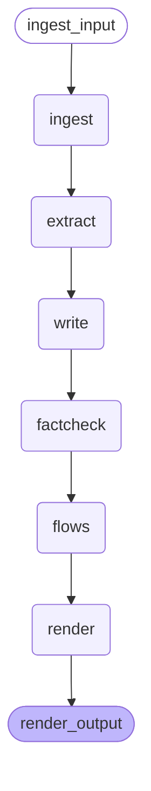
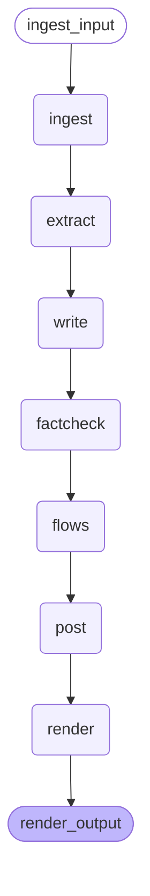
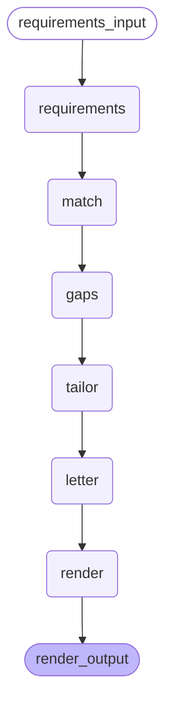
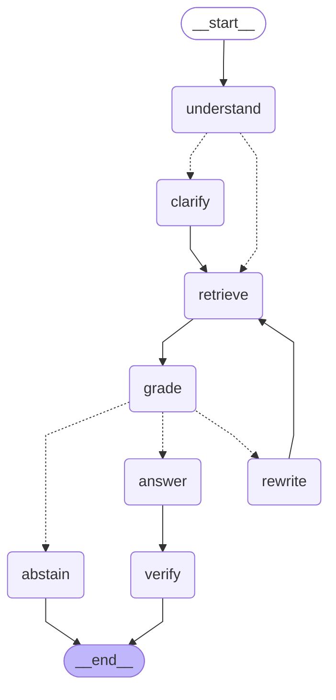
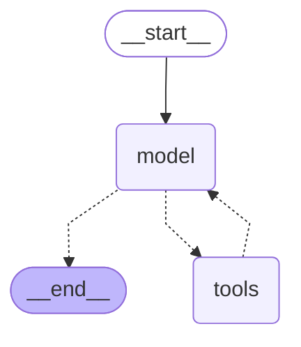

# labmate graphs

Generated by `make graphs`; don't edit by hand.

## paper2flow (chain)

```mermaid
---
config:
  flowchart:
    curve: linear
---
graph TD;
	ingest_input([ingest_input]):::first
	ingest(ingest)
	extract(extract)
	write(write)
	factcheck(factcheck)
	flows(flows)
	render(render)
	render_output([render_output]):::last
	ingest_input --> ingest;
	ingest --> extract;
	extract --> write;
	write --> factcheck;
	factcheck --> flows;
	render --> render_output;
	flows --> render;
	classDef default fill:#f2f0ff,line-height:1.2
	classDef first fill-opacity:0
	classDef last fill:#bfb6fc
```

## paper2post (chain)

```mermaid
---
config:
  flowchart:
    curve: linear
---
graph TD;
	ingest_input([ingest_input]):::first
	ingest(ingest)
	extract(extract)
	write(write)
	factcheck(factcheck)
	flows(flows)
	post(post)
	render(render)
	render_output([render_output]):::last
	ingest_input --> ingest;
	ingest --> extract;
	extract --> write;
	write --> factcheck;
	factcheck --> flows;
	flows --> post;
	render --> render_output;
	post --> render;
	classDef default fill:#f2f0ff,line-height:1.2
	classDef first fill-opacity:0
	classDef last fill:#bfb6fc
```

## cv2job (chain with one agent step)

```mermaid
---
config:
  flowchart:
    curve: linear
---
graph TD;
	requirements_input([requirements_input]):::first
	requirements(requirements)
	match(match)
	gaps(gaps)
	tailor(tailor)
	letter(letter)
	render(render)
	render_output([render_output]):::last
	requirements_input --> requirements;
	requirements --> match;
	match --> gaps;
	gaps --> tailor;
	tailor --> letter;
	render --> render_output;
	letter --> render;
	classDef default fill:#f2f0ff,line-height:1.2
	classDef first fill-opacity:0
	classDef last fill:#bfb6fc
```

## ask (graph)

```mermaid
---
config:
  flowchart:
    curve: linear
---
graph TD;
	__start__([<p>__start__</p>]):::first
	understand(understand)
	clarify(clarify)
	retrieve(retrieve)
	grade(grade)
	rewrite(rewrite)
	answer(answer)
	verify(verify)
	abstain(abstain)
	__end__([<p>__end__</p>]):::last
	__start__ --> understand;
	answer --> verify;
	clarify --> retrieve;
	grade -.-> abstain;
	grade -.-> answer;
	grade -.-> rewrite;
	retrieve --> grade;
	rewrite --> retrieve;
	understand -.-> clarify;
	understand -.-> retrieve;
	abstain --> __end__;
	verify --> __end__;
	classDef default fill:#f2f0ff,line-height:1.2
	classDef first fill-opacity:0
	classDef last fill:#bfb6fc
```

## ask (agent)

```mermaid
---
config:
  flowchart:
    curve: linear
---
graph TD;
	__start__([<p>__start__</p>]):::first
	model(model)
	tools(tools)
	__end__([<p>__end__</p>]):::last
	__start__ --> model;
	model -.-> __end__;
	model -.-> tools;
	tools -.-> model;
	classDef default fill:#f2f0ff,line-height:1.2
	classDef first fill-opacity:0
	classDef last fill:#bfb6fc
```
