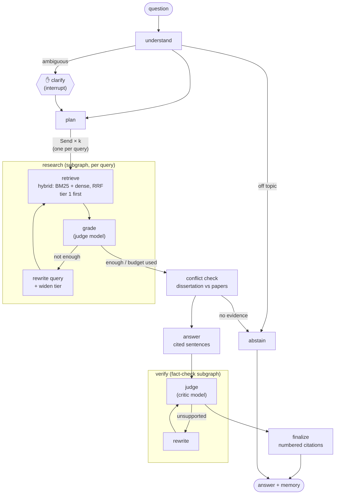
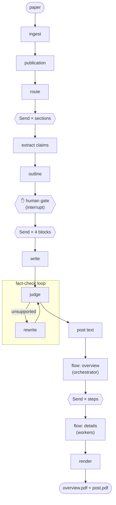
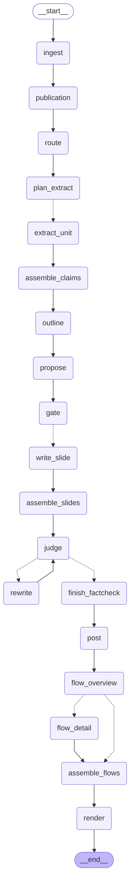
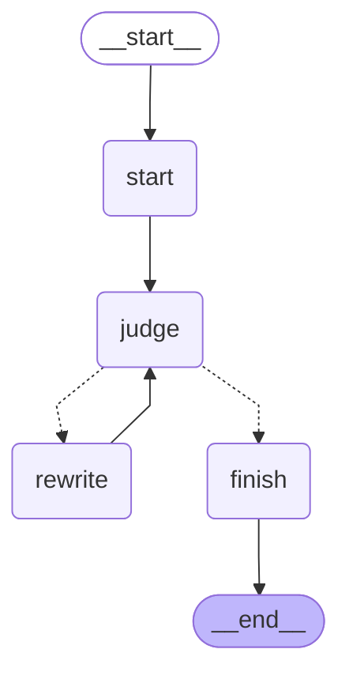

# labmate graphs

Generated by `make graphs` from the compiled LangGraph graphs; don't edit by hand.

## ask: overview

## paper2flow: overview

## paper2flow (LangGraph engine)

## ask

## ask · research subgraph (one per planned query)

## ask · verify subgraph (shared fact-check loop)

## ask · prebuilt baseline (LangChain create_agent)

