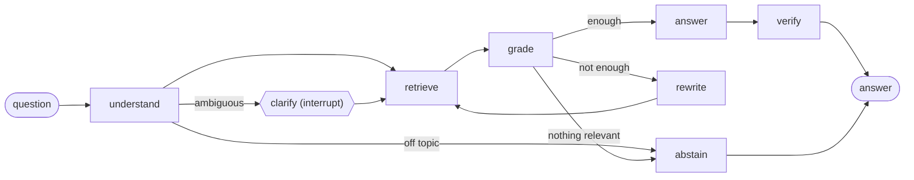

<!--
Keep near-identical to README.md (minus GitHub chrome). Update both in the same PR.
-->

# labmate

> Local research tools on Ollama: paper overviews, LinkedIn posts, and cited answers about a paper library.

All features run on local models through [Ollama](https://ollama.com) and share one core.
Each is labelled by who decides the next step: **code** (a chain or a graph, the model fills in
each step) or **the model** (an agent that picks its own tools).

| Feature | What it does | Next step decided by | Built with |
|---|---|---|---|
| **paper2flow** | A research paper in, `overview.pdf` out: a cover, four fact-checked cards and data-flow diagrams | code | LangChain chain |
| **paper2post** | A research paper in, `post.pdf` out: a fact-checked LinkedIn post, its links and the pipeline image | code | LangChain chain |
| **ask** (graph) | A question about a library of PDFs in, a cited answer out | code | LangGraph graph |
| **ask** (agent) | The same task, with the model choosing its tools | the model | LangChain `create_agent` |

## Shared core (`labmate.core`)

- **Models:** `ChatOllama` from `langchain-ollama`, built in one place (`core/chat.py`) with the
  configured sampling settings (temperature 0, fixed seed, thinking off).
- **Reply cache:** a SQLite cache serves a repeated request (same messages, model and options)
  without calling the model, so reruns are instant. Its key includes the model, its options and
  the output schema.
- **Structured output:** `structured` validates a reply against a Pydantic schema, puts the schema
  in the system prompt as well as in Ollama's `format` (the MLX builds ignore `format`), and
  retries with the error shown to the model.
- **Grounding:** claim cards carry verbatim quotes that are checked against the source; a
  fact-check loop (judge, rewrite) drops statements the evidence does not support.
- **Tracing:** set `LANGSMITH_TRACING=true` to send chain and graph runs to LangSmith; nothing is
  sent otherwise.

## paper2flow

```
analyze    = ingest | publication | route | extract | outline | write | factcheck | flows
paper2flow = analyze | render                                          -> overview.pdf
```

`overview.pdf` (A4 portrait):

1. the **cover**: title, authors, venue and publication date, and the paper's main figure;
2. the **four cards** of a project page: **Task**, **Challenges**, **Proposed method**,
   **Main results**;
3. the **end-to-end data flow**, top to bottom, from the raw data to the target output;
4. one page per **detail flow** that breaks a step of the overview down ("detail A", ...).

Every step is a named Runnable that fills in one field of the chain's state and saves it as a JSON
artifact in `runs/<paper id>/`:

| Step | Pattern | What it does |
|---|---|---|
| ingest | plain code | arXiv id or URL, PDF URL or PDF path: sections via the PDF outline, figures cropped, arXiv metadata |
| publication | structured output + check | venue and publication date read off the first page; accepted only if copied verbatim from it |
| route | routing | title + abstract: method / benchmark / survey / position |
| extract | parallelisation | per section (`.batch`): claim cards with verbatim quotes; quotes not in the paper, or with other numbers, are dropped in code |
| outline | orchestrator | assigns claim cards to the four cards; rules checked in code and fed back on violation |
| write | prompt chaining | one call per card, in parallel; every bullet cites the claim ids it uses |
| factcheck | evaluator-optimizer | numbers and names must be in the cited quotes; a different model judges each bullet; failures are rewritten (at most 2 rounds), then dropped |
| flows | orchestrator-workers | the planner draws the end-to-end flow and picks 1-3 steps; one worker per step draws its detail. Checked in code: starts at inputs, ends at outputs, grounded labels, no invented numbers |
| render | plain code | typed graphs to Mermaid to PNG with mermaid-cli; Typst lays out the PDF without a creation date, so the same inputs render the same bytes |

The model only proposes *data* (typed boxes and arrows); code validates it and writes the
Mermaid, so no model output reaches a diagram or a page unchecked.

## paper2post

```
paper2post = analyze | post | icons | render                          -> post.pdf
```

Page 1 of `post.pdf` (4:5) is the post text, ready to copy: a hook, 3-5 sentences, a question, one
icon per sentence (from a bundled set of Tabler Icons, so the model can only pick valid ones) and
the links: the paper, its code if it names a repository, and your own links from `config.toml`
`[post.links]`. Page 2 is the end-to-end pipeline diagram, to attach as the post's image. Every
sentence passes the same fact-check as the overview, and the analysis is reused from the cache.

## ask

Questions about a library of PDFs, answered with citations such as "[Dissertation §4.2, p. 57]".
`library/library.toml` lists the documents:

```toml
[[source]]
id = "dissertation"
file = "pdf/dissertation.pdf"
title = "..."
label = "Dissertation"   # the short name used in citations
```

**Index** (`make index`): each PDF is split along its outline into sections and sentence-packed
chunks of about 180 words, plus one chunk per figure or table caption. Tables flattened into rows
of numbers are left out, because a model reads their numbers wrongly. Chunks are searched with
BM25 (SQLite FTS5) and dense vectors (`embeddinggemma`), fused with reciprocal rank fusion. Only
the embedding model runs at index time.

**Graph** (`--agent graph`, the default): the code fixes the path.



- **understand:** decides whether the library can answer the question, and writes the search query.
- **clarify:** if the question could mean different things, the graph pauses (`interrupt`) and
  resumes with the reading you choose (`--choice N`, or asked in the terminal).
- **retrieve, grade, rewrite:** the judge model grades the hits; if they are not enough, the query
  is rewritten and searched again, up to `max_loops` rounds.
- **answer, verify:** the writer answers in sentences that each cite chunk ids; the judge model
  then reads every sentence with its chunks and drops the unsupported ones. Code also drops a
  sentence whose numbers are not in its chunks. If nothing survives, the graph abstains.

**Agent** (`--agent agent`): LangChain's `create_agent` with the tools `search_library`,
`read_context` and `list_sources`. The model decides what to search, whether to read more and when
to stop. Its answer goes through the same sentence checks as the graph's.

```bash
make index                                  # library/*.pdf -> library/index.sqlite
make ask Q="How many heads does the base Transformer use?"
make ask Q="..." AGENT=agent                # the tool-calling agent
make eval-answers                           # graph vs agent on library/golden.yaml
make graphs                                 # Mermaid diagrams of every chain and graph -> docs/graphs.md
make studio                                 # LangGraph Studio (needs a free LangSmith account)
```

## Evaluation

```bash
make eval           # paper2flow metrics of every finished run -> evals/results.md, results.json
make eval-answers   # ask: graph vs agent on library/golden.yaml -> evals/ask/answers.md
```

- **Run metrics** come from the run artifacts, no model needed: verified vs rejected claims, the
  share of first-draft bullets that failed the fact-check, bullets dropped after the loop, *card
  fit* (the share of bullets citing a claim of their card's kind) and the size of the diagrams.
- **Answers:** `library/golden.yaml` lists questions, the sources a good answer cites and which
  questions the library cannot answer. The report scores correct refusals, cited sources and how
  many drafted sentences the checks removed, for the graph and the agent.

## Models

| Role | Model |
|---|---|
| Writer / planner | `qwen3.6:35b-mlx` |
| Judge (fact-check, grading, verification) | `gemma4:26b-mlx` |
| Embeddings | `embeddinggemma:latest` |

Both chat models were checked for structured output and tool calling. The roles are set in
`config.toml`.

## Quickstart

```bash
make install     # uv sync + pre-commit hooks + mermaid-cli (needs Node.js)
make check       # lint + type-check + tests + docs (no Ollama needed)

# with Ollama running and the models pulled:
make flow PAPER=1706.03762                 # runs/1706.03762/overview.pdf
make post PAPER=1706.03762                 # runs/1706.03762/post.pdf
make flow PAPER=https://adamfodor.com/pdf/2023_Fodor_Adam_MDPI_BlinkLinMulT.pdf
```

`LABMATE_OLLAMA_HOST` overrides `[ollama].host`, for Ollama on another machine.

## Reply cache

`[cache]` in `config.toml` sets the SQLite file (`cache/replies.sqlite`) and can switch caching
off. A changed prompt, schema, model or sampling option is a new request and calls the model;
unchanged requests do not. Delete the file to start fresh.

## License

[AGPL-3.0-or-later](https://github.com/fodorad/labmate/blob/main/LICENSE). PyMuPDF, used for PDF parsing, is AGPL-licensed.

```{toctree}
:maxdepth: 2
:caption: Contents

api
```
