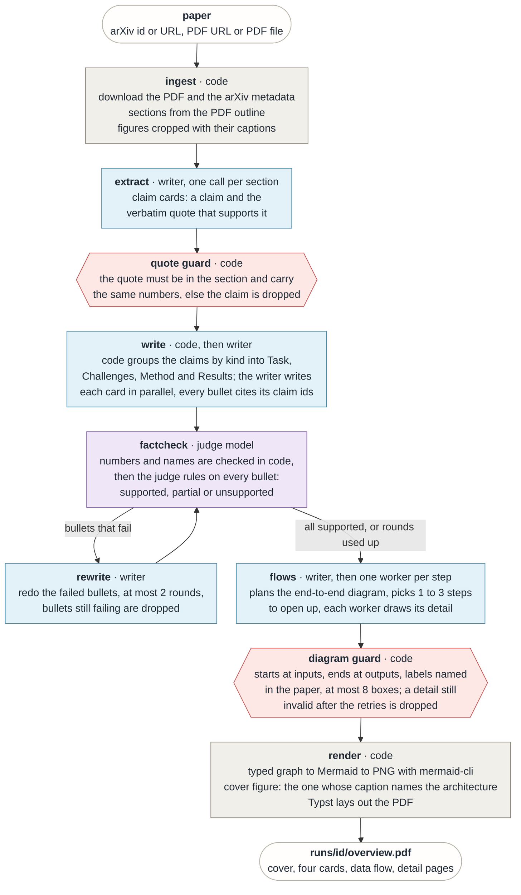
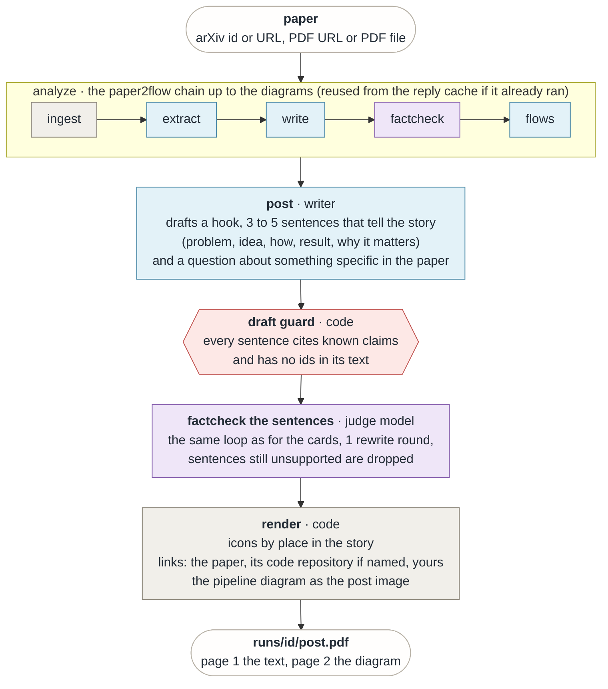
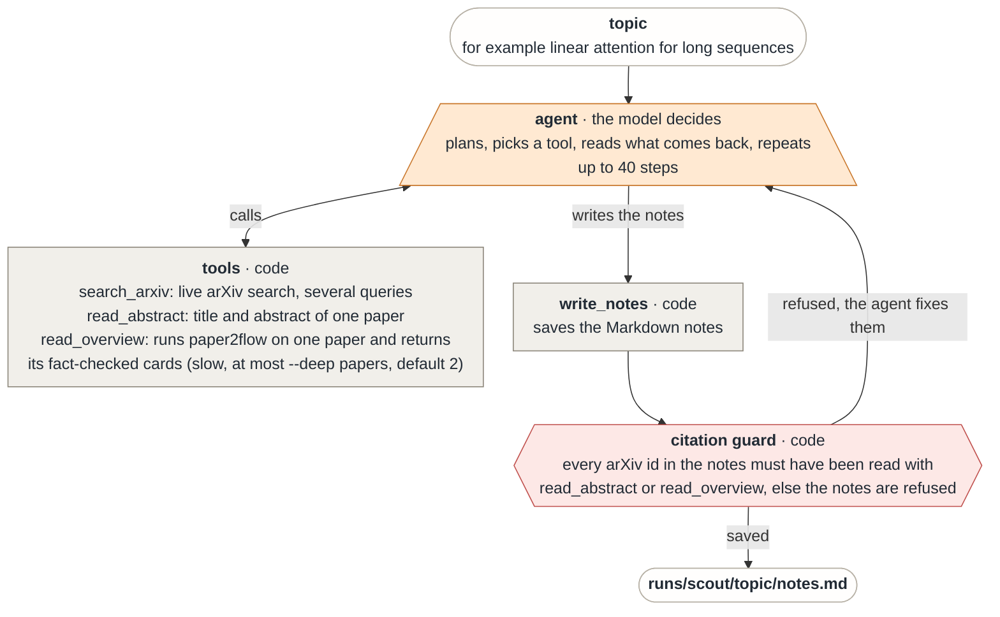
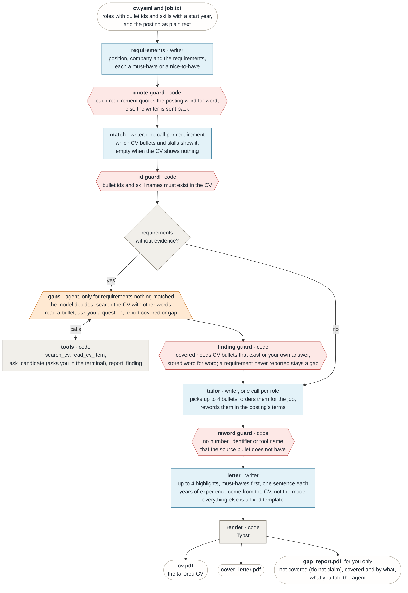
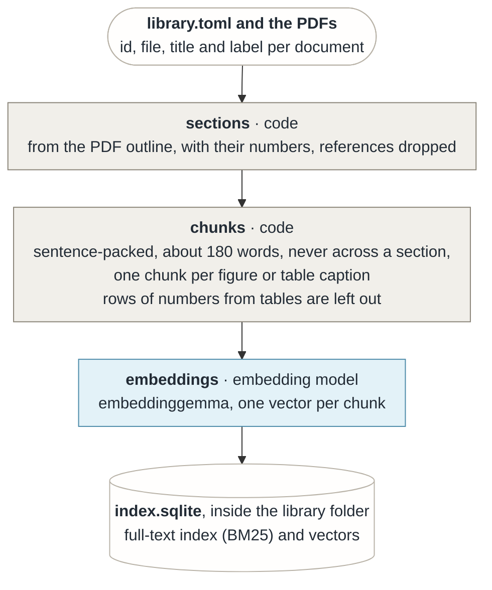
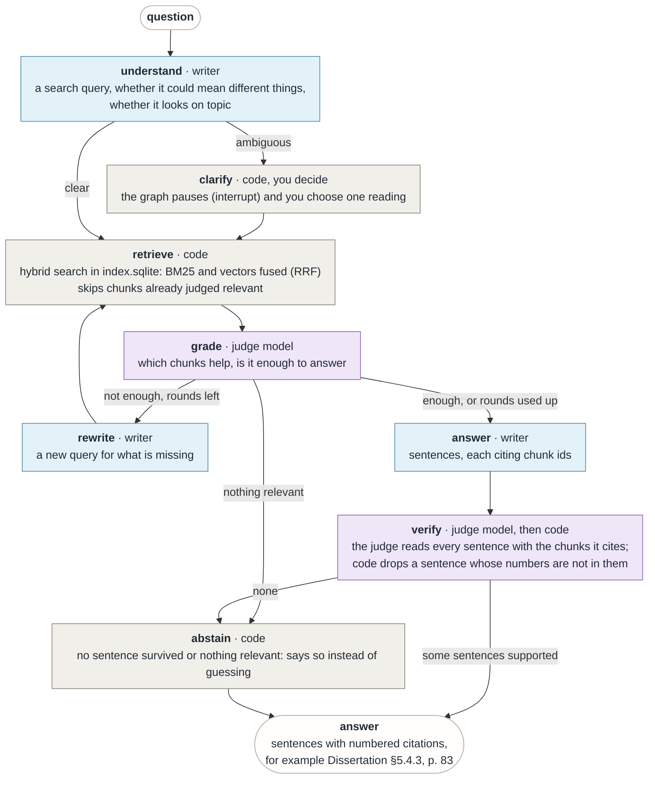
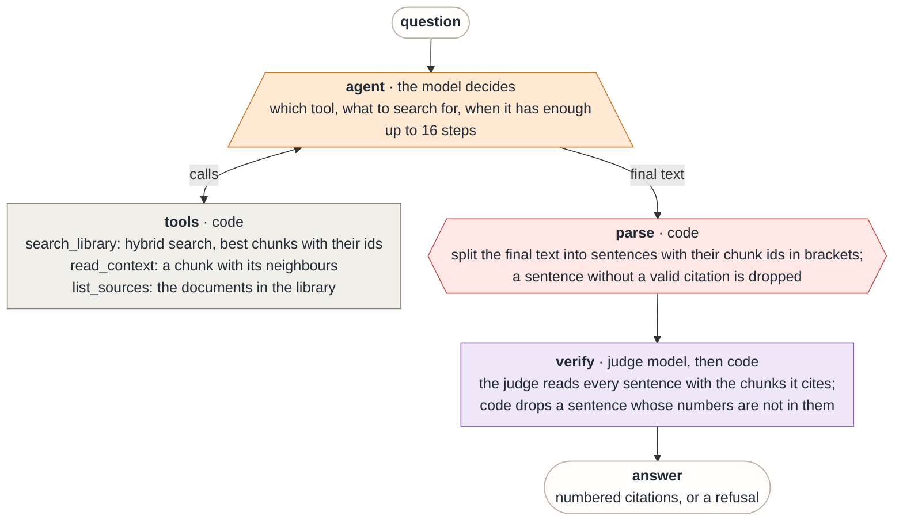
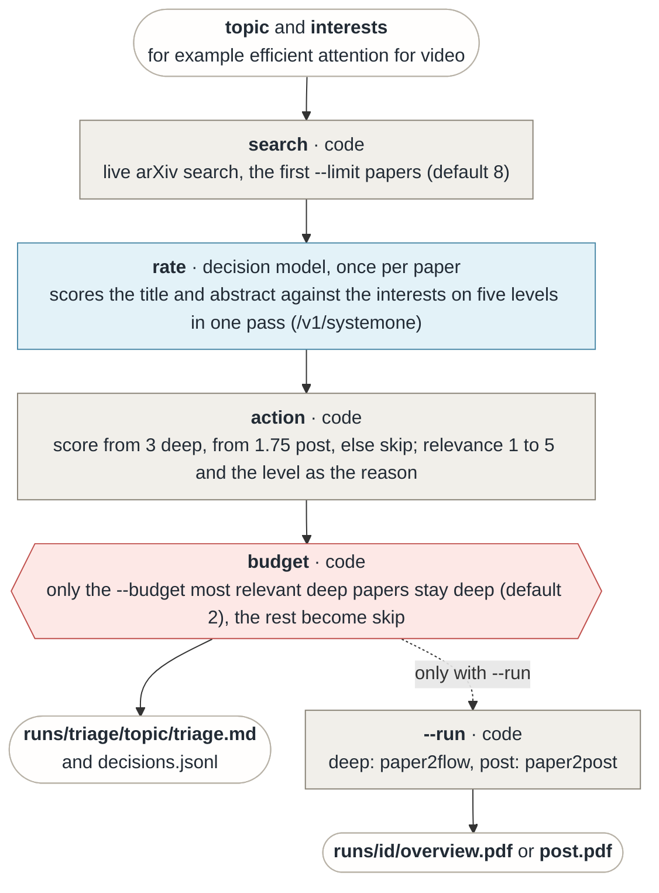

# labmate pipelines

One diagram per use case, drawn from the code: what goes in, which step runs, who does the work
(code, a model, or an agent), what is checked, and what comes out. The same diagrams are in the
[README](https://github.com/fodorad/labmate#readme); a test fails if the two copies differ or if a
chain step is missing from its diagram. `make graphs` writes LangChain's own drawing of the steps to
[graphs.md](graphs.md).

| Shape and colour | Meaning |
|---|---|
| grey box | plain code, no model |
| blue box | a model call (the writer, `[models].text`; in triage the decider, `[models].decider`) |
| purple box | the judge model (`[models].critic`) |
| orange trapezoid | an agent: the model chooses the next action |
| red hexagon | a check in code that can send the model back or drop its output |
| white (rounded or cylinder) | an input, an output or a file |

Every diagram reads top to bottom. Every model call goes through the reply cache
(`cache/replies.sqlite`): an unchanged request is answered from it, so a rerun only calls the model
for what changed.

## paper2flow

Type: chain

A paper in, `overview.pdf` out. A chain: the code fixes the order, the model fills in each step.



## paper2post

Type: chain

A paper in, `post.pdf` out. It reuses paper2flow's analysis and adds a post.



## scout

Type: agent

A topic in, `notes.md` out. An agent: nothing fixes the order of its steps.



## cv2job

Type: chain with one agent step

A CV and a job posting in; a tailored CV, a cover letter and a gap report out. A chain whose `gaps` step is an agent.



## ask: index

Type: pipeline

Before you can ask, `make index` turns the library's PDFs into a search index. Only the embedding model runs.



## ask: graph

Type: graph

A question in, an answer with numbered page citations out. A graph: the code fixes the path. An "off topic" verdict from `understand` is a hint, not a gate: the question is searched once, and the graph refuses only if nothing relevant comes back.



## ask: agent

Type: agent

The same task with the model in charge. It searches, reads, and stops when it decides; its answer goes through the same sentence checks as the graph's.



## triage

Type: workflow with a decision model

A topic and your interests in, a sorted reading list out. The code searches arXiv and loops over the
papers; the decider model (`[models].decider`, by default the decision model `clef-flash`) rates each
paper against your interests, and the code turns the rating into one decision: read it deeply, make a
post of it, or skip it. The code keeps the deep reads within a budget. With `--run` the chosen papers
go through paper2flow or paper2post.

A decision model does not write text. Ollama serves it on `/v1/systemone`: it gets the paper and a
typed question and scores every option in one pass, so a paper costs one short request and the answer
is a number, not a sentence. Any other model (for example `gemma4:e4b`) also works as the decider and
is then asked for the action and a reason as validated JSON. Which kind it is comes from the
capabilities Ollama lists for it. On 36 hand-labelled cases `clef-flash` gets the action right 30
times, `nimble` 29, `tev1` 28 and `gemma4:e4b` 16 (see `docs/benchmarks.md`).



```bash
make triage TOPIC="efficient attention for video" INTEREST="video emotion recognition"
make triage TOPIC="..." INTERESTS=private/interests.md RUN=1   # also make the PDFs
```

Without `--run` nothing but the table is made, so a triage costs one short request per paper.
